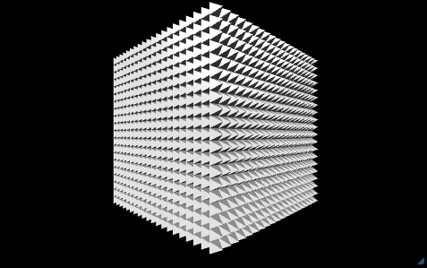

# Timed Assessment | Cube of Pyramids

This is a timed assessment. It is "open book" and you may look things up online and reference course materials in completing the assessment. However, you may not copy and paste code, and you should be aware that a complete answer to the prompts is not readily available online. You must use coding concepts in a unique way in order to complete the stated objectives. Given that you have limited time, be strategic about spending time looking things up when in fact you may have the answer in your memory. 

This timed assessment is regulated by the school's honor code. You can't help or receive help from other students taking the test during the exam period. Please refrain from discussing the test with other students for two weeks, in case a classmate takes the test at a later date. (You also cannot discuss the tests with students in future sections of this class who haven't taken it.)

Github will scrape your Trinket immediately after your last submission during the exam period. Changes made to your Trinket after the exam will not be graded. **There is no Gatorgrader in this repo, so don't look for checks!**

## Instructions 

1. Open links below in a separate tab so you can easily reference these instructions. 
2. Sign in to your [trinket.io](https://trinket.io/) account.
3. Find the starter code at [this link](https://trinket.io/glowscript/abdbbda7b3). Hit the "Remix" button on the upper right ot make your own copy. You can toggle "remix" if you want to reference the original code. 
4. Remember, you will have more chances to get points for each of these categories. You still have enough chances to get full credit even if you don't achieve any of the objectives on this test! 
5. **For your code to receive credit, it must be documented with comments. You must also document the starter code. Complete the comments for one objective before moving on the next.**
6. In this timed assessment, you have the chance to receive one point for **while loops**, one point for **variables**, and one point for **math & logic**. You should **NOT** use for loops or lists in this assessment. **Scroll down to [Objectives](#objectives) to learn how to get credit for each objective.**
7. When you are done, hit Save (to the left of the remix button).
8. Click the share-tree button near the top-left, then click "Link" and copy your link.
9. Paste the link from the last step into LINK.md file in this repo by clicking the filename (above), clicking the pencil to edit, and commiting your changes with the green "Commit" button on the upper right 

## Objectives

### First steps

Start by documenting lines 19-28 of the starter code with code comments. This will help you get to know the code so you can edit it successfully. It is also required to document all code (including the starter code) to receive credit for objectives. 

Be specific in your comments. For example, in lines 21-23, say what each variable is going to do in the code that follows. 

To get a point for each of the categories, complete the objective under the appropriate heading. Note that you do not have to go in the order suggested, and you can receive credit for any combination of the objectives completed. 

### Variables

Create a variable called `clr` BEFORE the nested while loop and assign it a color value. Then, use `clr` to color the pyramids drawn inside the while loop. Document your code with comments and save. 

### While Loops

Notice that the nested while loops in the starter code draw a 20 X 20 square made of pyramids. Your objective is to add a third nested while loop and change the code so that the trinket draws a 20 X 20 X 20 cube made of pyramids. 

The output should look something like this, except if you've completed the **Variables** objective it will be the color you have assigned in your clr variable:

Document your code with comments and save. 

### Math & Logic 

Notice that the two while loops in the starter code use the same comparison operation (`<`) and math operation (`+`) to complete the square.

To receive credit for this objective, you will change the math operation that determines a pyramid's place on **one** of the three axes to a subtraction (`-`) operation, and then alter a couple of other lines of code so that the overall output remains the same. For example, you could change the `+` on line 26 or 28 of the starter code to a `-`, and then update other parts of the code as needed. If you've already completed the **While Loops** objective, you could choose to change the operation that affects the z-axis.

Again, when complete, this change should NOT affect the output on the canvas. It is different method of achieving the same objective. 

HINT: Watch out for infinite loops!

Document your code with comments and save. 

### When finished

When you have completed as many objectives as you can in the allotted time and documented all your code with comments, add your trinket link to LINK.md (steps 7-9) of instructions. Again, there is no Gatorgrader in this repo, so don't waste time looking for checks. 
